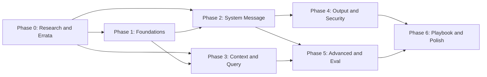

# Writing Roadmap — "Prompt Engineering for RAG"

> A phased, dependency-aware plan for writing the article described in
> [`TABLE_OF_CONTENTS.md`](TABLE_OF_CONTENTS.md). Each phase lists the sections it produces,
> which of the existing draft documents in `Related Docs/` can be reused, what new research or
> examples are needed, and an explicit **Definition of Done**.

---

## How to Read This Roadmap

- **Section numbers** (e.g., 2.3) refer to `TABLE_OF_CONTENTS.md`.
- **Reuse** lists the existing `.docx` drafts in `Related Docs/` whose verified content feeds that phase. Reused content must pass the errata filter below.
- **Effort** is a relative estimate (S = ~1 session, M = ~2–3 sessions, L = ~4+ sessions of focused writing).
- Phases 1–5 produce drafts; nothing is "final" until Phase 6.

---

## Phase 0 — Research Consolidation & Errata (Effort: S)

**Goal:** lock down the factual foundation before any prose is written.

**Tasks**
1. Build a bibliography file (`SOURCES.md`) with full citations and links for every primary source listed at the end of `TABLE_OF_CONTENTS.md`.
2. Apply the errata list below to all content carried over from `Related Docs/`.
3. For each remaining quantitative claim planned for the article, record its primary source; claims without a source are cut or reworded qualitatively.

### Errata from Existing Drafts (must be corrected before reuse)

| # | Issue in existing drafts | Correction |
|---|---|---|
| 1 | Evaluation framework referred to as "Ragus" | Correct name is **RAGAS** (Es et al., arXiv:2309.15217) |
| 2 | Specific unverifiable statistics (e.g., hallucination reduced "to ~2%" by the phrase *Never speculate beyond context*; "~40% improvement" from source identifiers) | No primary source found. Remove the numbers; keep the qualitative claims (both directions of effect **are** supported by published guidance) or replace with sourced figures (e.g., Anthropic's published Contextual Retrieval numbers: 49% reduction in retrieval failures combined with reranking: 67%) |
| 3 | Smart-ordering recipe stated as a universal rule (Top-1 first, Top-2 last) | Keep as a *recommended heuristic* grounded in the Lost-in-the-Middle U-curve (Liu et al. 2023), but note that attention patterns vary per model and ordering should be validated with evals (OWASP makes the same caveat) |
| 4 | Instruction-defense framing implies prompt-level defenses are sufficient | OWASP is explicit that **no prompt-level defense fully mitigates injection**; the article must present prompt defenses as one layer of defense-in-depth |

**Definition of Done:** `SOURCES.md` exists; every claim in the outline maps to a source or is marked "qualitative only".

---

## Phase 1 — Foundations (Part 1) (Effort: S)

**Sections:** 1.1 – 1.4

**Reuse:** `The Architecture of Prompt Engineering for RAG Systems.docx` (four-block anatomy — verified and reusable).

**New work**
- Write the "three prompt surfaces" framing (query reformulation / system rules / synthesis) — this is new relative to the drafts and becomes the article's organizing spine.
- Build the first full annotated example prompt (all four blocks) — this example is reused and extended throughout the article, so design it carefully (pick one running domain, e.g., a product-support assistant).

**Definition of Done:** a reader with zero RAG background can define every term used in later parts; the running example exists.

**Dependencies:** Phase 0 (bibliography and errata) — otherwise independent; can be written in parallel with Phases 2–3.

---

## Phase 2 — The System Message (Part 2) (Effort: L)

**Sections:** 2.1 – 2.7 (the largest reuse opportunity)

**Reuse:**
- `Architecting Professional RAG System Messages.docx` (chapter skeleton)
- `Persona Assignment Example.docx` (2.1)
- `The Faithfulness Mandate_ Controlling Hallucination in RAG Systems.docx` + `Faithfulness Mandate Examples.docx` (2.2)
- `Architecture of Reliable RAG Guardrails and Fallback Behaviors.docx` + `Architectural Guardrails and Fallback Examples.docx` (2.3 – 2.5)
- `Architecture of Scenario-Based System Instructions.docx` + `The Architect's Manual for Scenario-Based AI Operations.docx` (2.6)
- `Foundations of Prompt Instruction Engineering.docx` + `The Art of Precise Prompt Engineering for RAG Systems.docx` (2.7)

**New work**
- Strip errata items 1–2 from the reused material.
- Verify each concrete prompt snippet against current OpenAI/Anthropic guidance and rewrite examples in English.
- Add the "why fallback is a prerequisite for faithfulness" argument (2.3) explicitly.

**Definition of Done:** every subsection ends with at least one copy-pasteable English prompt block; all statistics sourced or removed.

**Dependencies:** Phase 1 (running example).

---

## Phase 3 — Context Injection & Query-Side Prompting (Parts 3–4) (Effort: L)

**Sections:** 3.1 – 3.5 and 4.1 – 4.7

**Reuse:**
- `Context Injection Strategies for RAG Architecture.docx` (3.1)
- `Architectural Precision in Contextual Prompt Engineering.docx` + `Smart Ordering Strategies for Context Retrieval.docx` (3.2 – 3.3)
- `Architectural Layers of Metadata Enrichment for Contextual Retrieval.docx` + `Strategic Framework for Metadata Enrichment Implementation.docx` (3.4 – 3.5)

**New work**
- Part 4 is written from scratch (no existing draft covers query-side prompting). Primary sources: HyDE (Gao et al. 2022), Step-Back (Zheng et al. 2023), plus the 2026 advanced-RAG surveys already collected.
- Apply erratum 3 (ordering as heuristic, not law) to the smart-ordering section.
- Build the enriched-chunk XML template (3.4) and one worked prompt per technique in Part 4.
- Write the decision table (4.7) mapping failure mode → technique.

**Definition of Done:** Part 3 examples align with the Anthropic/OpenAI structuring guidance cited in Phase 0; each Part 4 technique has a prompt template plus a one-line "use when / avoid when" verdict.

**Dependencies:** Phase 1. Independent of Phase 2 — can be written in parallel with it.

---

## Phase 4 — Output Control & Security (Parts 5–6) (Effort: M)

**Sections:** 5.1 – 5.4 and 6.1 – 6.5

**Reuse:** `Securing RAG Systems via Instruction Defense Layers.docx` (6.3, after applying erratum 4).

**New work**
- Part 5 is mostly new: structured-output patterns, citation output contracts, the "fallback few-shot example" argument, and conflicting-sources handling.
- Part 6 is rebuilt on the OWASP RAG Security Cheat Sheet and OWASP LLM Top 10 (LLM01, LLM07): threat model, knowledge-base poisoning vectors, prompt-level defenses *with their documented limits*, and the defense-in-depth layers around the prompt.
- Include one concrete before/after example of an indirect injection and the defended prompt that resists it.

**Definition of Done:** Part 6 explicitly states the OWASP position that prompt defenses are necessary but not sufficient; every defense listed maps to an OWASP recommendation.

**Dependencies:** Phase 2 (citation rules 2.4 are referenced by 5.2; instruction blocks are referenced by 6.3).

---

## Phase 5 — Advanced Architectures & Evaluation (Parts 7–8) (Effort: M)

**Sections:** 7.1 – 7.5 and 8.1 – 8.4

**Reuse:** minor — token-budget notes from `The Architect's Manual for Scenario-Based AI Operations.docx` (7.4).

**New work**
- Written from scratch against primary sources: Self-RAG (Asai et al. 2023), CRAG (Yan et al. 2024), RAGAS (Es et al.), vendor prompt-caching documentation, and per-vendor prompting guides.
- 7.5 (model-specific) must be checked against the *current* vendor docs at time of writing — this section dates fastest; add a "last verified" date stamp in the text.
- 8.2 includes a worked example: one bad answer scored by all four RAGAS metrics, showing how the scores localize the failure to a prompt surface.

**Definition of Done:** every architecture in Part 7 is presented as prompt patterns the reader can apply without fine-tuning; Part 8 contains a runnable-style RAGAS example and the prompts-as-code workflow.

**Dependencies:** Phases 2–4 (advanced sections reference faithfulness, ordering, and security concepts).

---

## Phase 6 — Production Playbook, Review & Polish (Part 9 + whole article) (Effort: M)

**Sections:** 9.1 – 9.4, plus final passes over Parts 1–8.

**Tasks**
1. Assemble the three annotated master templates (9.1) from the prompt blocks written in Phases 2–4 — these must be *derived from*, not parallel to, the article body.
2. Write the diagnostic failure-mode table (9.2) and the shipping checklist (9.3).
3. **Technical fact-check pass:** re-verify every citation and claim against `SOURCES.md`.
4. **Template testing pass:** run each master template against at least one live model per vendor; fix instructions that models ignore or misread.
5. **Consistency pass:** one term per concept throughout (e.g., always "chunk", never mixing "passage/segment"; always "system message"; always "Faithfulness Mandate").
6. Finalize the references section (9.4).

**Definition of Done:** article reads end-to-end without forward references that don't resolve; all templates tested; bibliography complete.

**Dependencies:** all prior phases.

---

## Dependency Graph & Suggested Order

**Parallelization note:** Phases 2 and 3 are independent of each other and can be written in either order or in parallel. Phase 4 needs Phase 2; Phase 5 needs Phases 2–3.

**Suggested sequence for a single author:** 0 → 1 → 2 → 3 → 4 → 5 → 6.

---

## Summary Table

| Phase | Parts | Effort | Reuses existing drafts? | Blocking dependency |
|---|---|---|---|---|
| 0 — Research & errata | — | S | validates all of them | none |
| 1 — Foundations | 1 | S | 1 doc | Phase 0 |
| 2 — System message | 2 | L | 10 docs (heaviest reuse) | Phase 1 |
| 3 — Context & query | 3–4 | L | 5 docs (Part 4 from scratch) | Phase 1 |
| 4 — Output & security | 5–6 | M | 1 doc | Phase 2 |
| 5 — Advanced & eval | 7–8 | M | minor | Phases 2–3 |
| 6 — Playbook & polish | 9 + all | M | — | all |
