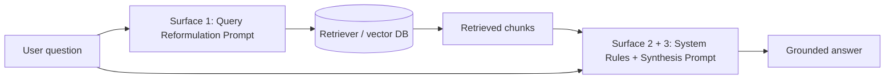

# Part 1 — Foundations

> **Level:** Beginner — no prior RAG knowledge required
> **What you'll learn:** what RAG is and why it exists, why prompting a RAG system is a different discipline from generic prompt engineering, the four building blocks of a RAG prompt, and the three prompt surfaces every production RAG system contains.
> **Prerequisites:** basic familiarity with what a large language model (LLM) is (e.g., you have used ChatGPT or Claude).

---

## 1.1 What Is RAG and Why It Exists

### The problem with a bare LLM

A large language model stores everything it "knows" in its weights — billions of numeric parameters learned during training. This knowledge is called **parametric memory**, and it has three fundamental problems:

1. **It goes stale.** A model trained in 2025 knows nothing about your product release from last month.
2. **It is incomplete.** The model has never seen your company's internal documentation, your support tickets, or your private database.
3. **It is unverifiable.** When the model answers from parametric memory, there is no document you can point to and say "this is where that claim came from." When the memory has gaps, the model often fills them with plausible-sounding fabrications — a failure mode called **hallucination**.

### The RAG solution

**Retrieval-Augmented Generation (RAG)** solves all three problems with one architectural idea: instead of asking the model to answer from memory, *find the relevant documents first and hand them to the model along with the question*.

A RAG pipeline has four stages:

```text
┌────────────┐   ┌────────────┐   ┌────────────┐   ┌────────────┐
│ INGESTION  │ → │  INDEXING  │ → │ RETRIEVAL  │ → │ GENERATION │
│ parse docs │   │ embed and  │   │ find chunks│   │ LLM writes │
│ split into │   │ store in a │   │ relevant to│   │ answer from│
│ chunks     │   │ vector DB  │   │ the query  │   │ the chunks │
└────────────┘   └────────────┘   └────────────┘   └────────────┘
```

1. **Ingestion** — documents (PDFs, wiki pages, tickets…) are parsed and split into smaller pieces called **chunks** (typically a few hundred tokens each).
2. **Indexing** — each chunk is converted into an **embedding** (a numeric vector capturing its meaning) and stored in a vector database. Many production systems also keep a keyword index (BM25) alongside.
3. **Retrieval** — when a user asks a question, the **retriever** finds the chunks most similar to the question and returns the top K results.
4. **Generation** — the retrieved chunks are inserted into the prompt of the LLM (the **generator**), which writes the final answer *grounded in* those chunks.

### Vocabulary you'll need

| Term | Meaning |
|---|---|
| **Chunk** | A piece of a source document, sized for retrieval (we always say "chunk" in this article, never "passage" or "segment") |
| **Context window** | The maximum amount of text (measured in tokens) the model can process in one prompt |
| **Embedding** | A numeric vector representation of text used for similarity search |
| **Retriever** | The component that finds relevant chunks for a query |
| **Generator** | The LLM that writes the final answer |
| **Parametric memory** | Knowledge stored in the model's weights (as opposed to knowledge in the retrieved chunks) |
| **Grounding** | Keeping the model's answer strictly tied to the retrieved evidence |
| **Hallucination** | A confident, fluent statement that is not supported by any source |

### Meet the running example: TechNova

Throughout this article we build one system together: a **customer-support assistant for TechNova**, a fictional company selling a cloud backup product called *NovaVault*. The assistant answers customer questions using TechNova's documentation: user guides, release notes, pricing pages, and troubleshooting articles.

By the final part of this article, you will have built — piece by piece, with the reasoning behind every line — a complete, production-grade prompt for this assistant. The finished result is assembled in [Part 10 — Capstone Walkthrough](10-capstone-walkthrough.md).

---

## 1.2 Why Prompt Engineering for RAG Is Different

Generic prompt engineering asks: *"How do I phrase my instruction so the model does what I want?"* That skill matters in RAG too, but RAG adds a second, harder question:

> *"How do I make the model behave correctly in the presence of injected, machine-selected, untrusted text?"*

Unpack those three adjectives, because each one creates a discipline of its own:

- **Injected.** The context the model reads was not written by you. It is pasted into the prompt at runtime by your pipeline. Your instructions must work for chunks you have never seen — including irrelevant ones, contradictory ones, and badly formatted ones.
- **Machine-selected.** The retriever chose the chunks, and retrievers make mistakes. Your prompt must define what the model should do when the retrieved context does not actually contain the answer. (Spoiler: without an explicit instruction, the model will make something up.)
- **Untrusted.** Anyone who can get text into your knowledge base — a customer filing a ticket, a vendor editing a shared wiki — can get text into your model's prompt. A chunk might contain the sentence *"Ignore all previous instructions."* Your prompt is part of your security surface.

This creates the **central tension of RAG prompt engineering**, which every technique in this article serves:

> The model must treat retrieved text as its **only source of truth** — while never treating it as a **source of instructions**.

Maximum trust in the content, zero trust in any commands inside it. Holding both at once is what the rest of this article teaches.

### A first taste: the same question, two prompts

Suppose a TechNova customer asks: *"Does NovaVault support end-to-end encryption?"* — and suppose the documentation says nothing about it (the feature does not exist).

**Naive prompt:**

```text
Answer the customer's question using this documentation:

{retrieved chunks about NovaVault's storage architecture}

Question: Does NovaVault support end-to-end encryption?
```

A typical result: the model sees words like "encryption at rest" and "TLS" in the chunks, pattern-matches, and confidently answers *"Yes, NovaVault supports end-to-end encryption"* — a hallucination that a support team will pay for later.

**RAG-engineered prompt (preview of Part 2):**

```text
You are a support assistant for TechNova's NovaVault product.

Answer using ONLY the information inside <context>. If the context does
not contain the information needed to answer, reply exactly:
"I don't have enough information in the documentation to answer that."
Never guess and never use knowledge from outside the context.

<context>
{retrieved chunks}
</context>

Question: Does NovaVault support end-to-end encryption?
```

Now the model has a permitted way to say "I don't know" — and instructions that make guessing a rule violation rather than the path of least resistance. This is the difference between prompting a chatbot and engineering a RAG system.

---

## 1.3 The Anatomy of a RAG Prompt

Every RAG generation prompt — from toy demos to production systems — is assembled from four canonical building blocks, in this order:

```text
┌─────────────────────────────────────────────┐
│ 1. SYSTEM MESSAGE                           │  who the assistant is,
│    persona · rules · guardrails             │  what it may and may not do
├─────────────────────────────────────────────┤
│ 2. INJECTED CONTEXT                         │  the retrieved chunks,
│    retrieved chunks + metadata              │  clearly delimited
├─────────────────────────────────────────────┤
│ 3. FEW-SHOT EXAMPLES (optional)             │  demonstrations of correct
│    Q/A pairs showing desired behavior       │  format and grounding
├─────────────────────────────────────────────┤
│ 4. USER QUERY                               │  the actual question,
│    placed last                              │  adjacent to generation
└─────────────────────────────────────────────┘
```

1. **System message** — the contract. It defines the assistant's persona, the rules for using (and not going beyond) the context, fallback behavior when the context is insufficient, citation requirements, and scope boundaries. Part 2 of this article is devoted entirely to it.
2. **Injected context** — the evidence. The retrieved chunks, wrapped in explicit delimiters (XML tags work well) and enriched with metadata such as source and date. Part 3 covers how to structure and order it.
3. **Few-shot examples** — the demonstrations. One to three worked examples showing a correctly grounded answer, a correct "I don't know" response, and the required citation format. Covered in Part 5.
4. **User query** — the question, placed **last**. Models weight the end of the prompt heavily during generation (a recency effect), so the query sits closest to where the answer is produced. Part 3 examines position effects in detail.

### A complete minimal example

Here is the smallest honest version of the TechNova prompt with all four blocks. Everything else in this article is a refinement of this skeleton:

```text
# ── 1. SYSTEM MESSAGE ─────────────────────────────────────────
You are Nova, a customer support assistant for TechNova's NovaVault
cloud backup product.

Rules:
- Answer using ONLY the information inside <context>.
- If the context does not contain the answer, say: "I don't have
  enough information in the documentation to answer that."
- Cite the source of every factual claim as [Source N].
- Only discuss NovaVault. Politely decline other topics.

# ── 2. INJECTED CONTEXT ───────────────────────────────────────
<context>
  <document id="1" title="NovaVault Pricing Guide" date="2026-05-02">
    NovaVault offers three plans: Basic (50 GB, $5/month), Pro
    (1 TB, $12/month), and Business (unlimited, $29/user/month).
  </document>
  <document id="2" title="NovaVault Release Notes v4.2" date="2026-06-18">
    Version 4.2 adds scheduled backups on the Pro and Business plans.
  </document>
</context>

# ── 3. FEW-SHOT EXAMPLE ───────────────────────────────────────
Example question: How much storage does the Basic plan include?
Example answer: The Basic plan includes 50 GB of storage [Source 1].

# ── 4. USER QUERY ─────────────────────────────────────────────
Question: Can I schedule backups on the Basic plan?
```

A well-behaved model answers something like: *"Scheduled backups are available on the Pro and Business plans [Source 2]. The documentation does not indicate that the Basic plan supports scheduled backups."* — grounded, cited, and honest about the boundary of its evidence.

---

## 1.4 The Three Prompt Surfaces of a RAG System

Beginners assume a RAG system has one prompt. Production systems have **three**, each engineered separately, each fixing a different class of failure:



### Surface 1 — The query reformulation prompt

Runs **before retrieval**. It transforms the raw user question into something the retriever can match well: expanding abbreviations, resolving pronouns from conversation history, splitting multi-part questions, or generating a hypothetical answer to search with. If retrieval returns junk, no synthesis prompt can save the answer — this surface determines *what evidence the model ever gets to see*.

Example (TechNova): the user's third message is *"and how much does it cost?"*. Embedded as-is, that query matches nothing useful. A reformulation prompt rewrites it to *"NovaVault Pro plan monthly price"* using the conversation history. Part 4 covers this surface.

### Surface 2 — The system / retrieval-rules prompt

The **control plane**: the system message that governs grounding behavior. It decides whether the model stays inside the retrieved evidence or drifts into parametric memory, what it does when evidence is missing, how it cites, and how it resists instructions embedded in the chunks. Parts 2 and 6 cover this surface.

### Surface 3 — The synthesis prompt

Controls **how retrieved chunks become an answer**: how the context is structured and ordered inside the prompt, how conflicting sources are reconciled, and what output format is produced. Parts 3 and 5 cover this surface.

### Why this mental model matters

When a RAG system misbehaves, the first diagnostic question is always: **which surface failed?**

| Symptom | Failed surface |
|---|---|
| The right documents were never retrieved | Surface 1 (query) — or the retriever itself |
| The right chunks were present but the model ignored or contradicted them | Surface 2 (system rules) |
| The answer is grounded but badly organized, uncited, or wrongly formatted | Surface 3 (synthesis) |

Part 8 shows how evaluation metrics localize failures to a surface automatically. The article's structure follows this model: Part 2 builds Surface 2, Parts 3 and 5 build Surface 3, Part 4 builds Surface 1, and Parts 6–8 harden and measure all three.

---

## Key Takeaways

- RAG exists because parametric memory is stale, incomplete, and unverifiable; retrieval hands the model fresh, private, citable evidence at prompt time.
- RAG prompt engineering is its own discipline because the context is **injected, machine-selected, and untrusted** — the model must treat it as the only source of truth but never as a source of instructions.
- Every RAG prompt is built from four blocks: **system message → injected context → few-shot examples → user query (last)**.
- A production RAG system has **three prompt surfaces** — query reformulation, system rules, and synthesis — and diagnosing failures starts with asking which surface broke.

**Next:** [Part 2 — Architecting the System Message](02-system-message.md), where we build the control plane of the TechNova assistant rule by rule.
